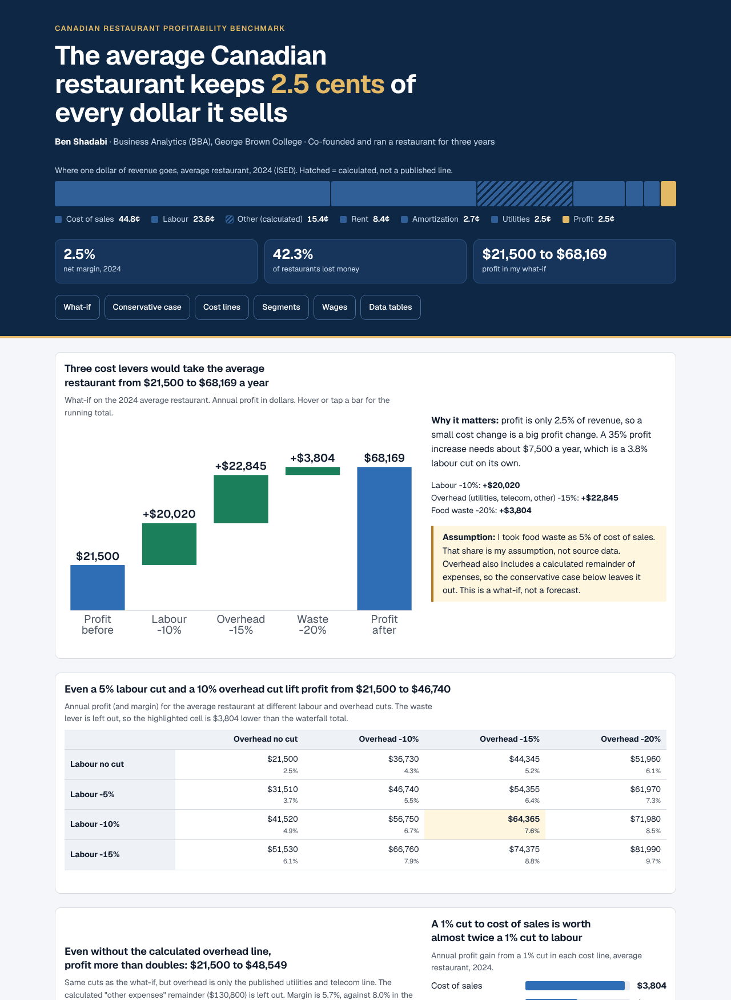
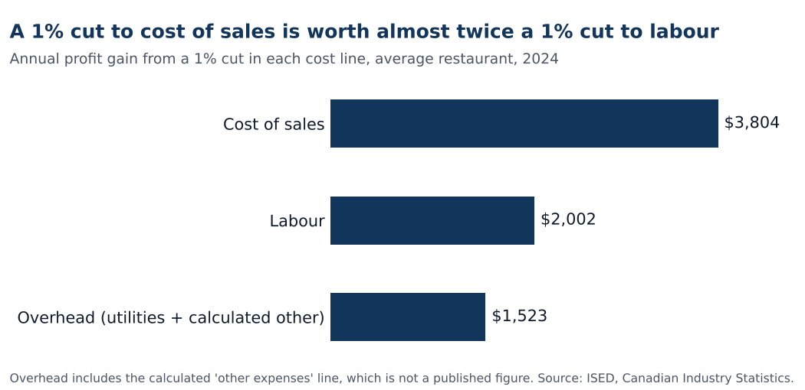

# Canadian Restaurant Profitability Benchmark (2019 to 2024)

[](https://github.com/BenShadabi/canadian-restaurant-profitability-benchmark/actions/workflows/checks.yml)

**Business question:** where does a typical Canadian restaurant make and lose money, and how much would tighter labour, overhead and waste control change its profit?

Built by **Ben Shadabi** with Claude Code, Business Analytics (BBA) student at George Brown College, Toronto. I co-founded and managed a restaurant for three years, so I know which numbers matter in this industry. This project tests those ideas against public data. Every figure comes from the published releases linked in `docs/methodology.md`.

**[Project page](docs/index.html)** and **[dashboard](docs/dashboard.html)** (download the repo and open `docs/dashboard.html`, or turn on GitHub Pages for the `/docs` folder).



All six charts as one image: [assets/dashboard.png](assets/dashboard.png).

## Key findings
1. **Margins are thin.** The average Canadian restaurant earned a 2.5% net profit margin in 2024 ($21,500 on $849,200 revenue). 42.3% of restaurants lost money. Industry-wide operating margin was 4.1%.
2. **Cost of sales and labour take about 68 cents of each dollar** (44.8% and 23.6% of revenue for the average restaurant). Rent is 8.4%.
3. **Counter and take-out style places were more resilient in the pandemic.** In 2020, full-service restaurants' operating margin fell to 0.3% while limited-service places earned 5.3% (6.9% in 2021). Limited-service revenue was ahead of full-service in 2020, 2021 and 2024 ($44.9B vs $44.2B in 2024).
4. **Wages are rising.** Average hourly pay in food services went from $16.78 (2020) to $19.48 (2024), up 16.1%.
5. **Small cost gains move profit a lot.** Because profit is only 2.5% of revenue, a +35% profit increase needs about $7,500 a year. That equals a 3.8% labour cut alone, or a 2.0% cut to cost of sales.

## What-if scenario (average restaurant)
| Lever | Assumption | Headline case | Conservative case |
|---|---|---|---|
| Labour cost | -10% | +$20,020 | +$20,020 |
| Overhead | -15% | +$22,845 (utilities, telecom and other) | +$3,225 (utilities and telecom only) |
| Food waste | -20% of an assumed 5% waste share of cost of sales | +$3,804 | +$3,804 |
| **Total** | | **$21,500 to $68,169 (margin 2.5% to 8.0%)** | **$21,500 to $48,549 (margin 2.5% to 5.7%)** |

These levers are the ones I used when running my own restaurant. Here they are applied to the industry average as a what-if, not as a forecast or a claim about any one business.

Two things to know before you trust the headline number:
- **Overhead uses a calculated line.** "Other expenses" ($130,800) is revenue minus every listed cost and profit. It is not a published figure, and it makes up $19,620 of the $22,845 overhead gain. The conservative case leaves it out. Profit still more than doubles.
- **The waste share is my assumption.** It matters little: testing 2% to 8% moves the headline profit between $65,887 and $70,451 (`data/waste_share_range.csv`). Edit it in the workbook.



A 1% cut to cost of sales is worth $3,804 a year, almost twice a 1% cut to labour ($2,002).

## Data
| Dataset | Source | Years |
|---|---|---|
| Average restaurant financials (NAICS 7225, 65,071 businesses, revenue $30k to $5M) | ISED Canadian Industry Statistics, based on Statistics Canada data | 2024 |
| Revenue, margin and cost shares, full-service vs limited-service | Statistics Canada, The Daily, annual food services releases | 2019 to 2024 |
| Average hourly wage, accommodation and food services | Statistics Canada Table 14-10-0206-01 (via ISED) | 2020 to 2024 |

All figures are typed from the published releases (links in `docs/methodology.md`). Contains information licensed under the Open Government Licence - Canada.

## Repository
```
data/
  Canadian_Restaurant_Benchmark.xlsx   workbook: Benchmark, Industry_Trend, Scenario, Wages, Sources
  industry_trend.csv                   annual industry series 2019-2024
  average_restaurant_2024.csv          average restaurant P&L and quartiles
  wages_food_services.csv              hourly wage series
  restaurant_counts_2024.csv           business count and share of restaurants with a loss
  sensitivity_labour_overhead.csv      profit at different labour and overhead cuts
  scenario_cases.csv                   before, conservative and headline cases
  lever_per_point.csv                  profit gain from a 1% cut in each cost line
  waste_share_range.csv                profit for an assumed waste share of 2% to 8%
analysis/scenario.py                   the scenario maths, read from the CSVs
analysis/build_scenarios.py            writes the three scenario CSVs and assets/lever_per_point.png
analysis/add_scenario_rows.py            one-off helper that added the conservative rows to the workbook (keeps its charts)
analysis/build_charts.py               rebuilds every PNG chart from the CSVs
analysis/build_dashboard.py            rebuilds docs/dashboard.html (the dashboard) from the CSVs
checks.py                              recomputes every headline number and checks the README, dashboard and workbook match
.github/workflows/checks.yml           runs checks.py on every push
assets/                                dashboard and individual charts
sql/queries.sql                        8 SQL queries on the same data (window functions, CTEs)
sql/run_queries.py                     loads the CSVs into SQLite, runs the queries, writes sql/results.md
docs/index.html, docs/dashboard.html   project page and dashboard
docs/methodology.md                    definitions, sources, limitations
requirements.txt                       pandas, matplotlib, tabulate, openpyxl
```

## How to reproduce
```
pip install -r requirements.txt
python analysis/build_charts.py
python analysis/build_scenarios.py
python analysis/build_dashboard.py
python sql/run_queries.py
python checks.py
```
`checks.py` recomputes every headline number from the CSVs and fails if the README, the dashboard, the SQL results or the workbook inputs disagree with the data. Open the workbook and change the blue cells on the **Scenario** tab to test other cuts.

## Limitations
- Averages hide wide differences between restaurants. The bottom quartile averaged a $13,000 loss while the top quartile averaged a $90,600 profit.
- The two sources use different bases. ISED reports **net profit** for small restaurants (2.5% margin); Statistics Canada reports **operating profit** for the whole industry (4.1%). Compare lines within one source only.
- Full-service plus limited-service revenue is less than the industry total ($89.1B vs $99.6B in 2024) because drinking places and other food services are not shown.
- Some 2019 and 2022 figures come from later releases that compare back to those years (Statistics Canada revised 2022 in 2024). Statistics Canada also revised 2020 later (full-service margin 0.5% instead of 0.3%), so I use the first published figures and label them. Segment margins for 2023 and 2024 were not published, and the 2019 limited-service margin is not stated in the releases, so those are blank.
- Scenario results are what-ifs on an average restaurant. They are not forecasts. The headline overhead cut applies to a calculated line, so read the conservative case ($48,549) as the safer number.
