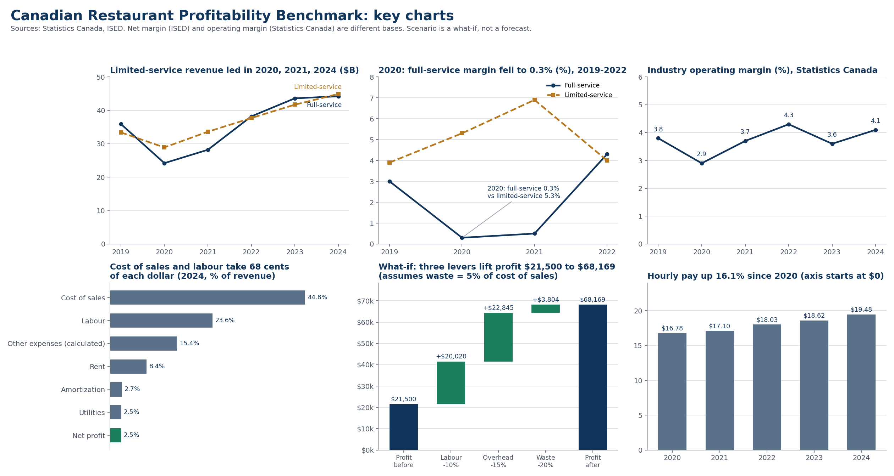

# Canadian Restaurant Profitability Benchmark (2019 to 2024)

**Business question:** where does a typical Canadian restaurant make and lose money, and how much would tighter labour, overhead and waste control change its profit?

Built by **Ben Shadabi**, Business Analytics (BBA) student at George Brown College, Toronto. I co-founded and managed a take-out and delivery restaurant for three years, so I know which numbers matter in this industry. This project tests those ideas against public data.



## Key findings
1. **Margins are thin.** The average Canadian restaurant earned a 2.5% net profit margin in 2024 ($21,500 on $849,200 revenue). 42.3% of restaurants lost money. Industry-wide operating margin was 4.1%.
2. **Cost of sales and labour take about 68 cents of each dollar** (44.8% and 23.6% of revenue for the average restaurant). Rent is 8.4%.
3. **Counter and take-out style places were more resilient in the pandemic.** In 2020, full-service restaurants' operating margin fell to 0.3% while limited-service places earned 5.3% (6.9% in 2021). Limited-service revenue passed full-service in 2024 ($44.9B vs $44.2B).
4. **Wages are rising.** Average hourly pay in food services went from $16.78 (2020) to $19.48 (2024), up 16.1%.
5. **Small cost gains move profit a lot.** Because profit is only 2.5% of revenue, a +35% profit increase needs about $7,500 a year. That equals a 3.8% labour cut alone, or a 2.0% cut to cost of sales.

## What-if scenario (average restaurant)
| Lever | Assumption | Profit effect |
|---|---|---|
| Labour cost | -10% | +$20,020 |
| Overhead (utilities, telecom, other) | -15% | +$22,845 |
| Food waste | -20% of an assumed 5% waste share of cost of sales | +$3,804 |
| **Total** | | **$21,500 to $68,169 (margin 2.5% to 8.0%)** |

These levers are the ones I used when running my own restaurant. Here they are applied to the industry average as a what-if, not as a forecast or a claim about any one business. The 5% waste share is my assumption, so edit it in the workbook.

## Data
| Dataset | Source | Years |
|---|---|---|
| Average restaurant financials (NAICS 7225, 65,071 businesses, revenue $30k to $5M) | ISED Canadian Industry Statistics, based on Statistics Canada data | 2024 |
| Revenue, margin and cost shares, full-service vs limited-service | Statistics Canada, The Daily, annual food services releases | 2019 to 2024 |
| Average hourly wage, accommodation and food services | Statistics Canada Table 14-10-0206-01 (via ISED) | 2020 to 2024 |

All figures are typed from the published releases (links in `docs/methodology.md`). Contains information licensed under the Open Government Licence - Canada.

## Repository
```
data/
  Canadian_Restaurant_Benchmark.xlsx   workbook: Benchmark, Industry_Trend, Scenario, Wages, Sources
  industry_trend.csv                   annual industry series 2019-2024
  average_restaurant_2024.csv          average restaurant P&L and quartiles
  wages_food_services.csv              hourly wage series
analysis/build_charts.py               rebuilds every chart from the CSVs
assets/                                dashboard and individual charts
docs/methodology.md                    definitions, sources, limitations
```

## How to reproduce
```
pip install pandas matplotlib
python analysis/build_charts.py
```
Open the workbook and change the blue cells on the **Scenario** tab to test other cuts.

## Limitations
- Averages hide wide differences between restaurants. The bottom quartile averaged a $13,000 loss while the top quartile averaged a $90,600 profit.
- The two sources use different bases. ISED reports **net profit** for small restaurants (2.5% margin); Statistics Canada reports **operating profit** for the whole industry (4.1%). Compare lines within one source only.
- Some 2019 and 2022 figures come from later releases that compare back to those years (Statistics Canada revised 2022 in 2024). Some segment margins for 2023 and 2024 were not in the releases I read, so they are blank.
- Scenario results are what-ifs on an average restaurant. They are not forecasts.

## Next steps
Add the monthly Statistics Canada revenue table (21-10-0019-01), retail food prices (18-10-0245-01) and the restaurant CPI to chart seasonality and ingredient costs against menu prices. Add Toronto DineSafe inspection data for a local view.
